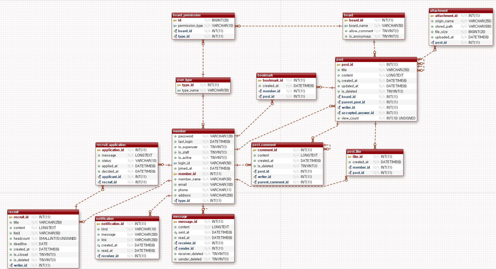

# 기회를 IT-DA

국비지원 교육과정 수강생과 수료생을 잇는 정보공유 커뮤니티입니다.
"먼저 겪은 사람과 지금 겪는 사람을 잇는다"를 목표로 만들었습니다.

> 이 저장소는 3인 팀 프로젝트([AXI260720TEAM3/axi_community](https://github.com/AXI260720TEAM3/axi_community))를 바탕으로,
> 발표 이후 개인적으로 개선을 이어가는 버전입니다. 팀 저장소는 발표 시점 그대로 남아 있습니다.

| | |
|---|---|
| 기간 | 2026.09.07 ~ 2026.09.23 (약 2주) |
| 인원 | 3명 (팀장으로 참여) |
| 기술 | Python 3.14 · Django 6.0 · MariaDB · WhiteNoise · Tailscale Funnel |
| 규모 | 테이블 13개 · 커밋 177개 |

## 왜 만들었나

국비 과정 수강생이 실제로 겪는 문제 세 가지에서 출발했습니다.

| 문제 | 해결 |
|---|---|
| 정보가 단톡방과 오픈채팅에 흩어져, 중요한 질의응답과 학습자료가 흘러가 버린다 | 공지사항 · 자유게시판 · Q&A |
| 수료하고 취업한 선배들이 어떻게 준비했는지 알 길이 없다 | 취업정보 · 멘토의 취업비밀(익명) |
| 혼자서는 포트폴리오용 프로젝트를 시작하기 어렵다 | 프로젝트 팀원 모집 |

## 주요 기능

- **게시판 5종**: 공지사항, 자유게시판, Q&A, 취업정보, 멘토의 취업비밀. 목록은 정렬 4종(최신·조회·추천·제목)과 검색, 페이지 나누기를 지원합니다.
- **회원유형별 작성 권한**: 수강생·강사·멘토·직원마다 쓸 수 있는 게시판이 다릅니다.
- **Q&A**: 수강생이 질문하고 강사·멘토가 답변하며, 질문자가 답변을 채택하면 해결로 표시됩니다.
- **멘토의 취업비밀**: 멘토만 글을 쓸 수 있고 글쓴이는 익명으로 표시됩니다.
- **첨부파일**: 드래그앤드롭으로 여러 파일을 올리고, 수정할 때 개별 삭제와 추가가 가능합니다.
- **소통**: 댓글과 대댓글, 추천, 1:1 쪽지, 알림.
- **프로젝트 팀원 모집**: 모집글 작성, 지원, 승인과 거절, 정원과 마감일 관리.
- **계정**: 회원가입, 아이디 중복확인, 아이디·비밀번호 찾기(메일 발송), 마이페이지.

## 내가 맡은 부분

팀장으로 DB 설계와 공통 구조를 잡고, 게시판·게시글·첨부파일과 배포를 담당했습니다.

| 담당 | 범위 |
|---|---|
| **본인 (팀장)** | DB 설계, 게시판 목록·검색·정렬, 글쓰기·수정·삭제, 첨부파일, 권한 판정, 공통 화면, 배포 |
| 팀원 B | 회원가입·로그인, 계정 찾기, 마이페이지, 팀원 모집, 맞춤 채용공고 |
| 팀원 C | 댓글·대댓글, Q&A, 쪽지, 알림 |

발표 전 주에는 전체 기능을 직접 눌러 보며 찾은 버그 20여 건을 영역 구분 없이 수정했습니다.
(정원 초과 승인, 조용히 실패하던 답변 등록, 원 댓글 삭제 시 답글 유실 등)

## 설계에서 신경 쓴 점

### 1. 작성 권한을 코드가 아니라 DB 표로 관리

게시판마다 `if board.name == "공지사항"` 같은 분기를 두면 게시판이 늘거나 이름이 바뀔 때마다 코드를 고쳐야 합니다.
그래서 `board_permission` 중간 테이블에 (게시판, 회원유형, 권한 구분) 조합을 넣고, **표에 있는 조합만 허용**하도록 했습니다.

```python
# community/permissions.py
def can_write(user, board, permission_type=BoardPermission.PermissionType.GENERAL):
    if not user.is_authenticated:
        return False
    return BoardPermission.objects.filter(
        board=board,
        user_type_id=user.user_type_id,
        permission_type=permission_type,
    ).exists()
```

권한 구분을 `일반 / 질문 / 답변`으로 나눠서 "수강생은 질문만, 강사는 답변만, 멘토는 둘 다" 같은 규칙도 행 추가만으로 표현됩니다.
개발 중 '익명게시판'을 '멘토의 취업비밀'로 바꿀 때도 권한 코드는 건드리지 않았습니다.

### 2. Q&A를 별도 테이블 없이 자기참조로 표현

답변은 질문과 같은 `post` 테이블에 저장하고 `parent`로 질문을 가리킵니다.
채택된 답변은 질문의 `accepted_answer`(1:1)로 연결해, 한 질문에 채택이 하나만 존재하도록 DB 수준에서 보장했습니다.

### 3. 익명성은 화면이 아니라 서버에서 지킨다

글쓴이 이름을 템플릿에서 숨기는 것만으로는 부족했습니다.
작성자 검색을 그대로 두면 이름으로 검색해 글쓴이를 특정할 수 있어서, 익명 게시판에서는 작성자 검색을 서버에서 무시합니다.
작성자에게 쪽지를 보내는 링크도 익명 게시판에서는 만들지 않습니다.

### 4. 쪽지는 각자의 쪽지함에서만 지운다

한쪽이 지웠다고 상대 쪽지함에서도 사라지면 안 되므로 `sender_deleted`, `receiver_deleted` 두 필드를 두고,
양쪽이 모두 지웠을 때만 행을 실제로 삭제합니다. 발송 취소는 상대가 읽기 전에만 가능합니다.

### 5. 첨부파일

확장자 화이트리스트와 파일당 10MB 제한을 서버에서 검사하고,
글이나 첨부를 지울 때는 DB 행뿐 아니라 디스크의 실제 파일까지 함께 지웁니다.

## ERD



테이블 13개, M:N 중간 테이블 1개(`board_permission`), 자기참조 3개(답변 `parent_post_id`, 채택 `accepted_answer_id`, 대댓글 `parent_comment_id`)로 구성됩니다.
논리 모델은 [docs/erd-logical.png](docs/erd-logical.png)에 있습니다.

## 배포 구조

```
인터넷 사용자  →  Tailscale Funnel (고정 주소 · HTTPS)  →  노트북: Django + WhiteNoise  →  학원 내부망 MariaDB
```

DB가 학원 내부망에 있어서, 클라우드로 옮기려면 DB부터 통째로 이전해야 했습니다.
2주라는 기간 안에서는 터널로 노트북을 공개하는 편이 현실적이라고 판단했습니다.

배포하면서 막혔던 것:

| 증상 | 원인과 해결 |
|---|---|
| `DEBUG=False`로 바꾸자 CSS가 전부 사라짐 | Django는 운영 모드에서 정적 파일을 직접 제공하지 않음 → WhiteNoise 도입 |
| 터널 주소에서 로그인·글쓰기가 403 | 터널 도메인이 CSRF 신뢰 대상이 아님 → `CSRF_TRUSTED_ORIGINS` 등록 |
| 보안 쿠키를 켜자 로컬 확인이 막힘 | `DEBUG`와 분리한 `SECURE` 스위치를 따로 둠 |

## 로컬에서 실행하기

Python 3.12 이상과 MariaDB(또는 MySQL)가 필요합니다.

```bash
git clone <이 저장소 주소>
cd axicommunity

python -m venv venv
venv\Scripts\activate            # macOS/Linux: source venv/bin/activate
pip install -r requirements.txt

copy .env.example .env           # 값 채우기: SECRET_KEY, DB_HOST, DB_PASSWORD
```

DB를 만들고 테이블과 샘플 데이터를 넣습니다.

```bash
mysql -u root -p -e "CREATE DATABASE community CHARACTER SET utf8mb4"
python manage.py migrate
mysql -u <DB_USER> -p --default-character-set=utf8mb4 community < sql/seed.sql
```

샘플 계정의 비밀번호를 Django 해시로 바꾸고, 샘플 첨부파일을 만든 뒤 실행합니다.

```bash
python manage.py shell -c "from community.models import Member; [(m.set_password('test1234'), m.save()) for m in Member.objects.all()]"
python sql/make_seed_files.py
python manage.py runserver
```

http://127.0.0.1:8000 에서 확인합니다. 샘플 계정은 `sql/seed.sql`에 있고 비밀번호는 모두 `test1234`입니다.
(예: 수강생 `gaon_lee`, 멘토 `mentor_kang`)

## 테스트

```bash
python manage.py test community
```

권한 판정, 익명 게시판, 첨부파일, Q&A 채택, 댓글, 쪽지, 팀원 모집, 로그인을 다루는 테스트 141개가 있습니다.
테스트용 DB(`test_community`)를 만들었다 지우므로, `.env`의 DB 계정에 DB 생성 권한이 있어야 합니다.

## 폴더 구조

```
config/                 설정, 최상위 URL
community/
  models.py             모델 13개
  permissions.py        작성 권한 판정
  views/                기능별 뷰 (board, post, qna, comment, message, notification, recruit, account, mypage, jobs)
  tests/                기능별 테스트
  templates/            화면
  static/community/     CSS, JS
sql/
  seed.sql              샘플 데이터
  make_seed_files.py    샘플 첨부파일 생성
docs/                   ERD
```

## 아쉬운 점과 개선 계획

발표 때 정리한 아쉬운 점을 이 저장소에서 하나씩 고쳐 나갑니다.

- [x] **자동화 테스트**: 발표 전까지는 화면을 직접 눌러 확인했습니다. 수정했던 버그와 핵심 규칙을 테스트 141개로 고정했습니다.
- [ ] **상시 접속 가능한 배포**: 노트북이 꺼지면 사이트도 멈춥니다. 클라우드로 옮깁니다.
- [ ] **스타일 정리**: 후반에 만든 화면 9개에 `<style>` 블록이 흩어져 있습니다. `app.css` 한 곳으로 모읍니다.
- [ ] **하드코딩 제거**: "게시판 이름을 코드에 박지 말자"는 규칙을 홈 화면에서 스스로 어겼습니다.
- [ ] **맞춤 채용공고 완성**: 현재는 더미 데이터입니다. 실제 채용 API를 연동합니다.

> "규칙을 정하는 것과 지키는 것은 다른 일이더라" — 이 프로젝트에서 가장 크게 배운 점입니다.
